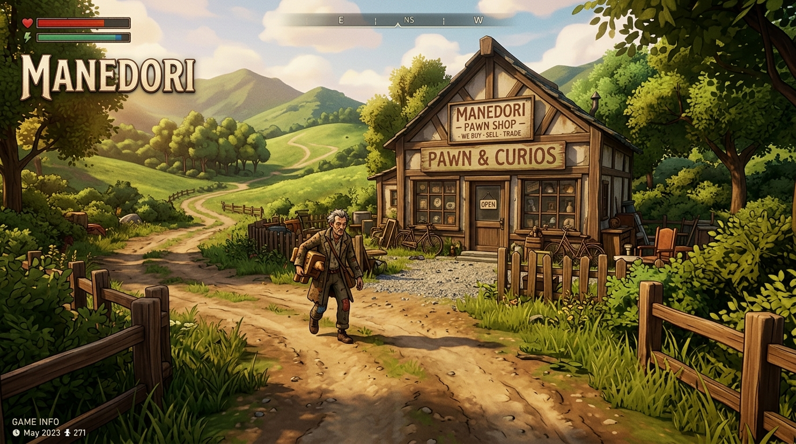
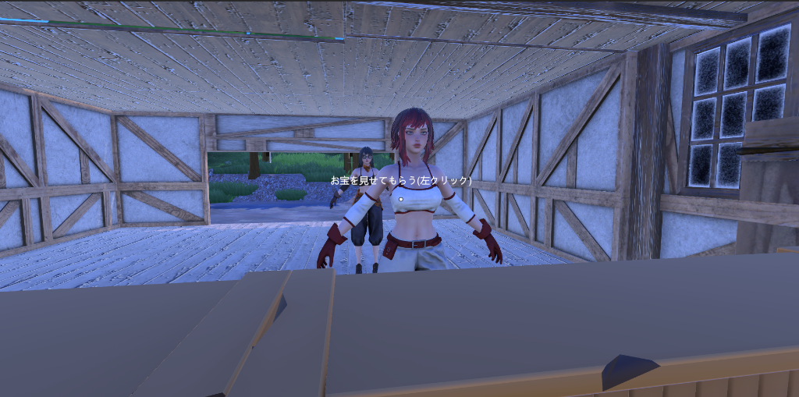

# ゲーム企画書：マネードリ (MANEDORI)


*▲ 田舎の一本道にぽつんと佇む主人公の家兼お店。遠くから客がお宝を携えて来店する（1人称視点3D RPG）*

---

## 📄 企画概要ファイルのご案内
本企画書は、**ブラウザ閲覧およびA4横サイズでの印刷・PDF保存に完全対応したグラフィカルな企画書HTML**として作成されています。

- 🖨️ **A4横 プレゼン企画書 (HTML)**: [`GameDesignDocument_Manedori.html`](file:///c:/GitHub/DeadRecovery/GraduationProject/GameDesignDocument_Manedori.html)
  *(ブラウザで開いて右上ボタンから印刷・PDF保存が可能です)*

---

## 1. 基本情報

| 項目 | 内容 |
| :--- | :--- |
| **タイトル** | **マネードリ** |
| **ジャンル** | RPG風・3D一人称 鑑定・査定シミュレーション |
| **視点 / 次元** | 3D / 1人称視点 (First-Person View) |
| **使用ツール** | Unity |
| **ターゲット層** | 若年層 |
| **製作期間** | 約3ヶ月 |

---

## 2. 世界観・設定

- **舞台**：田舎の一本道沿いにある主人公の家（ポツンと佇む一軒家兼ショップ）
- **雰囲気**：ノスタルジックかつ哀愁漂うRPG風の世界観
- **ストーリー背景**：
  - 主人公は**多額の借金**を抱えており、崖っぷちの状態。
  - 田舎の一本道を通る個性豊かなお客さんが、価値あるお宝（または怪しいガラクタ）を持ち込んでくる。
  - 主人公はそのお宝を鑑定制で観察・鑑定し、価値を見極めて買い取り、お金を稼いで借金を返済していく。

---

## 3. ゲームの目的と基本ループ

### 🎯 1. ゲームの目的
借金を返済するために、お客さんが持ち込むお宝を鑑定してお金を稼ぐ。

- **期限付きの返済ノルマ**：
  - 例：「3日以内に 50,000 G」「5日以内に 150,000 G」など
- 💀 **ゲームオーバー条件**：
  - **期限内にノルマ額を達成できなければゲームオーバー（主人公死亡）**

### 🔄 2. 基本ゲームループ（3ステップ）

```
【1. 買い取りフェーズ】
  └─ お客さんからお宝を受領
  └─ 鑑定台の上で3Dモデルをマウス操作で回転・拡大しながら詳しく観察

        ▼

【2. 査定フェーズ】
  └─ チェックリストUIを自ら操作
  └─ 「傷あり」「汚れあり」「偽刻印」等の状態を確認しチェック入力

        ▼

【3. 交渉と仕入れフェーズ】
  └─ チェック結果から自動算出された「予測金額」を提示・頼りにする
  └─ お客さんの感情（怒りメーター）を伺いながら交渉して買い取る
```

---

## 4. コアメカニクス

### 🧮 金額算出の仕組み（引き算システム）

- **基本最高価格（定価）**
  - お宝にはあらかじめ「傷や汚れが一切ない状態の基本最高価格」が設定されている。
- **ペナルティ引き算**
  - チェックリストで「傷あり」「汚れあり」「刻印偽造」などのマイナス要素を発見してチェックを入れるたび、定価から一定額が引き算され、「予測金額」が算出される。

### ⚠️ プレイヤーの罠・スリル（見落としリスク）

- **見落としのペナルティ**
  - 3D観察時に傷や汚れを見落としたまま高い予測金額で買い取ってしまうと、後々の販売やオークション時に「本当は価値が低い（不良品・偽物）」ことが発発覚する。
- **発生するリスク**：
  1. **お店の評価（評判）が急降下**
  2. **仕入れ値が高すぎて大損（手元に残る利益が激減・大赤字）**

### 😡 お客さんの反応（怒りメーター：%）

- **怒りメーターの上昇**
  - 買い取り価格を安く叩きすぎたり、鑑定に時間をかけすぎたりすると「怒りメーター（％）」が上昇。
- **怒り限界時のペナルティ**
  - 怒らせすぎると以下の重いペナルティが発生する：
    - **商品を没収される**
    - **鑑定台を奪われる**
    - **お店の評価（評判）が急降下**

### 🌟 好循環（インセンティブ）

- **評価アップと良客の来店**
  - 正しく買い取りを成功させてお店の評価が上がると、次からより高価で良いお宝を持った「良客」が来店するようになる！

### 🏺 お宝の種類
- まずは**10種類**を初期実装予定（具体的なリストは開発時に順次決定）。

---

## 5. 開発ロードマップ（約3ヶ月）

### 🚀 フェーズ1: MVP（最優先開発要素）
- [x] お客さんがお宝を売りに来る来店処理
- [x] 3Dモデル回転観察 ＆ チェックリスト引き算査定システム
- [x] 査定価格交渉、怒りメーター、見落としリスク処理
- [x] お店の評価システムとお金の増減
- [x] 借金ノルマ・期限システム
- [x] ゲームオーバー判定（死亡処理）

### 🔮 フェーズ2: 拡張要素（時間があれば実装）
- [ ] プレイヤー側からお宝を販売・オークションに出品できる機能
- [ ] 店舗インテリア・鑑定ツールのアップグレード、追加イベント客

---

## 6. 🛠️ 開発中画面（Unity実機実装ショット）


*▲ 画像説明：開発中のUnity実機画面。主人公の一人称視点でカウンター越しにお客さん（3Dキャラクター）と対面。「お宝を見せてもらう(左クリック)」の操作UIから鑑定フェーズへの移行処理を実装中。*

- **1人称視点の3D店舗**: カウンター越しにお客さんを迎え入れる視点を構築。店舗奥の大きな扉からは田舎の木々が見える。
- **操作インタラクション**: 画面中央の「お宝を見せてもらう(左クリック)」テキストにより、プレイヤーがお宝を受け取り鑑定・観察を始めるコアの体験ループを実装。

---

## 💀 ゲームオーバー条件
- **期限内にノルマ額を稼げなかった場合 ➔ 死亡**


