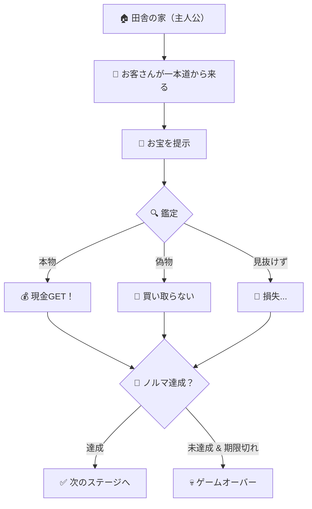

# 🎮 ゲーム企画書：マネードリ

---

## 📋 基本情報

| 項目 | 内容 |
|------|------|
| **タイトル** | マネードリ |
| **ジャンル** | RPG風・鑑定シミュレーション |
| **使用ツール** | Unity |
| **ターゲット層** | 若年層 |
| **製作期間** | 約3ヶ月 |

---

## 🌍 世界観・設定

- **舞台**: 田舎の一本道沿いにある主人公の家
- **雰囲気**: RPG風の世界観
- 主人公は **多額の借金** を抱えている
- 田舎の一本道を通るお客さんが、お宝を持ち込んでくる
- 主人公はそのお宝を **鑑定** し、本物か偽物かを見極めて商売をする

---

## 🎯 ゲームの目的

> **借金を返済するために、お客さんが持ち込むお宝を鑑定してお金を稼ぐ！**

- 毎回 **期限付きのノルマ** が設定される
  - 例：「3日以内に〇万円」「5日以内に〇万円」など
- 期限内にノルマを達成できなければ **ゲームオーバー（死亡）**

---

## ⚙️ コアメカニクス（ゲームの仕組み）

### 鑑定システム

```
お客さんが来店 → お宝を提示 → プレイヤーが鑑定 → 判定
```

| 判定結果 | 効果 |
|----------|------|
| **本物と見抜いた** ✅ | 良い値段で買い取り → 現金が増える |
| **偽物と見抜いた** 🚫 | 買い取らない → 損失を回避 |
| **偽物を本物と誤認** ❌ | 買い取ってしまう → 現金が減る（売れない） |

> [!NOTE]
> 鑑定の具体的な仕組み（見た目の違い・ヒント・手がかりなど）は開発時に詳細を決定予定

### お宝の種類

- 製作期間を考慮し、まずは **10種類** のお宝を実装予定

---

## 📅 開発ロードマップ

### フェーズ1：MVP（最小限の製品）🔴 最優先

- お客さんがお宝を売りに来る
- プレイヤーが本物・偽物を鑑定する
- 本物なら現金が増える仕組み
- 借金ノルマ＆期限システム
- ゲームオーバー判定

### フェーズ2：拡張要素 🟡 時間があれば

- プレイヤー側から **お宝を販売** できる機能
- その他追加コンテンツ

---

## ❌ ゲームオーバー条件

- **期限内にノルマ金額を稼げなかった場合 → 死亡**

---

## 🎨 イメージ



---

> [!IMPORTANT]
> 製作期間が **3ヶ月** と限られているため、MVP（フェーズ1）の完成を最優先とし、余裕があれば拡張要素を追加していく方針。
